# TTS2Go System Architecture Document

## 1. Executive Summary & System Overview

**TTS2Go** is a Go-based Text-to-Speech (TTS) synthesis engine that converts natural language text into spoken audio using neural network models. The system leverages ONNX Runtime for efficient ML model inference and supports multiple TTS model backends including Kitten TTS and Kokoro TTS.

### Primary Purpose

- Convert arbitrary text input into high-quality WAV audio files
- Provide a cross-platform CLI tool for TTS generation
- Support multiple voice profiles and speech speed control
- Enable offline TTS synthesis without cloud API dependencies

### Key Capabilities

| Feature | Description |
|---------|-------------|
| Multi-Model Support | Kitten TTS (nano/micro/mini) and Kokoro-82M models |
| Voice Selection | Multiple male/female voice embeddings per model |
| Speed Control | Adjustable speech rate (0.5x - 2.0x) |
| Audio Output | 24kHz mono WAV with 16-bit PCM encoding |
| Text Preprocessing | Automatic expansion of numbers, currency, time, contractions |

---

## 2. Technology Stack

### Core Technologies

| Category | Technology | Version/Details |
|----------|------------|-----------------|
| **Language** | Go | 1.25+ |
| **ML Runtime** | ONNX Runtime | 1.24.2+ |
| **Build System** | Just | Cross-platform task runner |

### Go Dependencies

| Package | Purpose |
|---------|---------|
| `github.com/yalue/onnxruntime_go` | Go bindings for ONNX Runtime inference |
| `github.com/neurlang/goruut` | Grapheme-to-phoneme conversion (G2P) |
| `github.com/rs/zerolog` | Structured logging |
| `github.com/spf13/viper` | Configuration management |
| `github.com/spf13/pflag` | CLI flag parsing |
| `golang.org/x/text` | Unicode text normalization |

### External Resources

| Resource | Source |
|----------|--------|
| Kitten TTS Models | `huggingface.co/KittenML/kitten-tts-*` |
| Kokoro TTS Models | `huggingface.co/onnx-community/Kokoro-82M-ONNX` |

---

## 3. High-Level Architecture & Code Organization

### Architectural Pattern

TTS2Go follows a **Pipeline Architecture** with clearly separated stages:

```mermaid
flowchart TB
    subgraph CLI["CLI Entry Point"]
        main["cmd/tts2go/main.go"]
    end

    subgraph Config["Configuration Layer"]
        config["internal/pkg/tts2go/config"]
        configDesc["Viper-based config: CLI flags → File → Environment"]
    end

    subgraph Pipeline["TTS Pipeline"]
        direction LR
        preprocess["Preprocess<br/>(text)"]
        phonemizer["Phonemizer<br/>(IPA)"]
        tokenizer["Tokenizer<br/>(int64)"]
        model["ONNX Model<br/>(waveform)"]
        audio["Audio<br/>(WAV)"]

        preprocess --> phonemizer --> tokenizer --> model --> audio
    end

    CLI --> Config --> Pipeline
```



### Directory Structure

```
tts2go/
├── cmd/
│   └── tts2go/           # Application entry point
│       ├── main.go       # CLI setup, orchestration
│       └── version.go    # Build version metadata
├── internal/
│   └── pkg/
│       └── tts2go/       # Core TTS engine
│           ├── audio/    # WAV encoding/output
│           ├── config/   # Configuration loading
│           ├── model/    # ONNX model wrapper
│           ├── phonemizer/  # G2P conversion
│           ├── preprocess/  # Text normalization
│           ├── tokenizer/   # Phoneme tokenization
│           └── voice/    # Voice embedding loader
├── configs/              # Sample configuration files
├── docs/                 # Documentation
├── models/               # Downloaded model files (runtime)
│   └── voices/           # Voice embedding files
├── lib/                  # ONNX Runtime shared library
├── bin/                  # Build output
├── test/                 # Test data files
├── go.mod                # Go module definition
├── go.sum                # Dependency checksums
└── justfile              # Build automation recipes
```

### Package Responsibilities

| Package | Responsibility |
|---------|----------------|
| `cmd/tts2go` | CLI entry point, argument parsing, orchestration |
| `config` | Multi-source configuration (flags, file, env) |
| `model` | ONNX session management, inference execution |
| `preprocess` | Text cleaning, number/currency/time expansion |
| `phonemizer` | Grapheme-to-phoneme conversion via goruut |
| `tokenizer` | Phoneme → token index mapping |
| `voice` | Voice embedding loading (NPZ, NPY, BIN formats) |
| `audio` | WAV file encoding and output |

### Package Dependency Diagram


---

## 4. Core Components & Modules

### 4.1 TTS Engine (`model/onnx.go`)

The central orchestrator that manages the TTS pipeline.

```go
type TTS struct {
    session      *ort.DynamicAdvancedSession  // ONNX inference session
    voices       *voice.VoiceStore            // Voice embeddings
    preprocessor *preprocess.Preprocessor     // Text normalizer
    phonemizer   *phonemizer.Phonemizer       // G2P converter
    tokenizer    *tokenizer.Tokenizer         // Token encoder
}
```

**Key Methods:**
- `NewTTS(modelPath, voicesPath)` - Initialize engine with model files
- `Generate(text, voice, speed)` - Execute full TTS pipeline
- `ListVoices()` - Return available voice names
- `Close()` - Clean up ONNX resources

### 4.2 Text Preprocessor (`preprocess/preprocess.go`)

Normalizes input text for consistent phonemization.

**Processing Pipeline:**
1. Unicode NFC normalization
2. URL/HTML/email removal
3. Contraction expansion ("won't" → "will not")
4. Number verbalization (42 → "forty two")
5. Currency expansion ($5.50 → "five dollars and fifty cents")
6. Time expansion (3:30 PM → "three thirty pm")
7. Ordinal expansion (1st → "first")
8. Quote/punctuation normalization
9. Whitespace normalization

### 4.3 Phonemizer (`phonemizer/phonemizer.go`)

Converts normalized text to IPA phonetic representation using the goruut library.

```go
func (ph *Phonemizer) Phonemize(text string) string
// Input:  "Hello world"
// Output: "həˈloʊ wɜːld" (IPA phonemes)
```

### 4.4 Tokenizer (`tokenizer/tokenizer.go`)

Maps IPA phoneme characters to integer token indices for model input.

**Symbol Vocabulary:** 180+ symbols including:
- Punctuation: `_ ; : , . ! ?`
- Latin alphabet: `A-Z a-z`
- IPA phonemes: `ɑ ɐ ɒ æ ɓ ʙ β ɔ ɕ ç ...`
- Diacritics/modifiers: `ˈ ˌ ː ˑ ʼ ...`

### 4.5 Voice Store (`voice/voice.go`)

Loads and manages voice embedding vectors.

**Supported Formats:**
| Format | Description | Use Case |
|--------|-------------|----------|
| `.npz` | NumPy compressed archive | Kitten TTS (all voices in one file) |
| `.npy` | NumPy array file | Individual voice files |
| `.bin` | Raw float32 binary | Kokoro TTS voices |

**Embedding Specification:**
- Dimension: 256 float32 values
- Supports float16 → float32 conversion

```mermaid
flowchart TB
    subgraph VoiceLoading["Voice Loading Strategy"]
        path["voices_path"]

        path --> check{File or Directory?}

        check -->|"File (.npz)"| npz["LoadVoices()<br/>Parse NPZ archive"]
        check -->|"Directory"| dir["LoadVoicesFromDir()<br/>Scan directory"]

        npz --> parseNpy["Parse .npy files<br/>from archive"]

        dir --> scanFiles{File type?}
        scanFiles -->|".npy"| loadNpy["loadNpyVoice()"]
        scanFiles -->|".bin"| loadBin["loadBinVoice()"]

        parseNpy --> convert{Data type?}
        loadNpy --> convert
        loadBin --> store

        convert -->|"float16"| f16["float16ToFloat32()"]
        convert -->|"float32"| store["VoiceStore"]
        f16 --> store
    end

    store --> get["Get(voiceName)<br/>→ []float32"]

    style npz fill:#e3f2fd
    style dir fill:#e8f5e9
    style store fill:#fff3e0
```



### 4.6 Audio Output (`audio/wav.go`)

Generates WAV files from model output.

**Audio Specifications:**
| Parameter | Value |
|-----------|-------|
| Sample Rate | 24,000 Hz |
| Channels | 1 (Mono) |
| Bit Depth | 16-bit PCM |
| Format | RIFF WAV |

### Component Interaction Diagram


---

## 5. Data Flow & State Management

### 5.1 TTS Generation Data Flow

```mermaid
flowchart LR
    subgraph Stage1["Stage 1: Input"]
        input["Text Source<br/>(CLI/file/stdin)"]
        inputData["'Hello, I have $5 at 3:30 PM'"]
    end

    subgraph Stage2["Stage 2: Preprocessing"]
        preprocess["Preprocessor<br/>• Normalize unicode<br/>• Expand numbers<br/>• Expand currency<br/>• Expand time"]
        preprocessData["'hello i have five dollars<br/>at three thirty pm'"]
    end

    subgraph Stage3["Stage 3: Phonemization"]
        phonemize["Phonemizer (goruut)<br/>• G2P conversion"]
        phonemeData["'həˈloʊ aɪ hæv faɪv<br/>ˈdɑlɝz æt θɹi ˈθɝdi piˈɛm'"]
    end

    subgraph Stage4["Stage 4: Tokenization"]
        tokenize["Tokenizer<br/>• Symbol → Index"]
        tokenData["[0, 64, 17, 124, 88, 75, ...]<br/>(int64 tensor)"]
    end

    subgraph Stage5["Stage 5: Inference"]
        inference["ONNX Session<br/>Inputs:<br/>• input_ids: [1,N]<br/>• style: [1,256]<br/>• speed: [1]"]
        waveform["waveform: [1, samples]<br/>(float32)"]
    end

    subgraph Stage6["Stage 6: Output"]
        encode["WAV Encoder<br/>• Clamp [-1, 1]<br/>• Scale to int16"]
        output["output.wav<br/>(24kHz, 16-bit PCM)"]
    end

    input --> inputData
    inputData --> preprocess
    preprocess --> preprocessData
    preprocessData --> phonemize
    phonemize --> phonemeData
    phonemeData --> tokenize
    tokenize --> tokenData
    tokenData --> inference
    inference --> waveform
    waveform --> encode
    encode --> output
```



#### Simplified Pipeline View

```mermaid
flowchart LR
    A["📝 Text Input"] --> B["🔧 Preprocess"]
    B --> C["🗣️ Phonemize"]
    C --> D["🔢 Tokenize"]
    D --> E["🧠 ONNX Inference"]
    E --> F["🔊 WAV Output"]

    style A fill:#e1f5fe
    style B fill:#fff3e0
    style C fill:#f3e5f5
    style D fill:#e8f5e9
    style E fill:#fce4ec
    style F fill:#e0f2f1
```



### 5.2 ONNX Model Interface

**Input Tensors:**

| Name | Shape | Type | Description |
|------|-------|------|-------------|
| `input_ids` | `[1, N]` | int64 | Tokenized phoneme sequence |
| `style` | `[1, 256]` | float32 | Voice embedding vector |
| `speed` | `[1]` | float32 | Speed multiplier (0.5-2.0) |

**Output Tensors:**

| Name | Shape | Type | Description |
|------|-------|------|-------------|
| `waveform` | `[1, samples]` | float32 | Raw audio waveform |

### 5.3 TTS Generation Sequence


### 5.4 State Management

TTS2Go is designed as a **stateless CLI application**. State exists only during a single invocation:

- **Initialization State:** ONNX session, voice embeddings loaded once
- **Request State:** Text, voice selection, speed passed per invocation
- **No Persistent State:** No session tracking, caching, or database

---

## 6. Design Patterns & Principles

### 6.1 Design Patterns Used

| Pattern | Implementation | Purpose |
|---------|----------------|---------|
| **Pipeline** | TTS.Generate() orchestrates Preprocess→Phonemize→Tokenize→Inference→Audio | Sequential data transformation |
| **Factory** | `NewTTS()`, `NewPreprocessor()`, `NewTokenizer()` | Consistent object creation |
| **Facade** | TTS struct wraps multiple subsystems | Simplified API for complex operations |
| **Strategy** | VoiceStore supports NPZ/NPY/BIN formats | Interchangeable data loading |
| **Configuration Object** | Config struct | Centralized configuration |


### 6.2 SOLID Principles

| Principle | Application |
|-----------|-------------|
| **Single Responsibility** | Each package handles one concern (tokenizing, phonemizing, etc.) |
| **Open/Closed** | Voice loading extensible via new format handlers |
| **Dependency Inversion** | TTS depends on interfaces, not concrete implementations |

### 6.3 Go Idioms

- **Error wrapping:** `fmt.Errorf("context: %w", err)`
- **Deferred cleanup:** `defer session.Destroy()`
- **Internal packages:** Private implementation in `internal/`
- **Struct embedding:** Not heavily used; composition via fields

---

## 7. Interfaces & APIs

### 7.1 Command-Line Interface

```
Usage: tts2go [options] [text]

Options:
  -c, --config string      Path to config file
  -t, --text string        Text to synthesize (use '-' for stdin)
  -f, --file string        Read text from file
  -o, --output string      Output WAV file (default "output.wav")
  -v, --voice string       Voice to use
  -s, --speed float32      Speech speed 0.5-2.0 (default 1.0)
  -m, --model string       Path to ONNX model file
      --voices string      Path to voices (NPZ or directory)
  -l, --log-level string   Log level (debug, info, warn, error)
      --log-file string    Log file path
      --list-voices        List available voices and exit
  -h, --help               Show help message
```

### 7.2 Configuration Hierarchy

Configuration sources (highest to lowest priority):

1. **Command-line flags** (e.g., `-v af_bella`)
2. **Config file** (`tts2go.cfg.toml`)
3. **Environment variables** (`TTS2GO_VOICE=af_bella`)
4. **Defaults** (hardcoded in config.go)

```mermaid
flowchart TB
    subgraph Priority["Configuration Priority (High → Low)"]
        direction TB
        flags["🏁 CLI Flags<br/>-v af_bella"]
        file["📄 Config File<br/>tts2go.cfg.toml"]
        env["🌍 Environment Variables<br/>TTS2GO_VOICE=af_bella"]
        defaults["⚙️ Defaults<br/>config.go"]
    end

    flags --> file --> env --> defaults

    viper["Viper<br/>Configuration Manager"]

    flags --> viper
    file --> viper
    env --> viper
    defaults --> viper

    viper --> config["Config Struct"]

    style flags fill:#c8e6c9
    style file fill:#fff9c4
    style env fill:#ffecb3
    style defaults fill:#ffcdd2
```



### 7.3 Programmatic API

```go
// Initialize TTS engine
tts, err := model.NewTTS("models/model.onnx", "models/voices.npz")
defer tts.Close()

// List available voices
voices := tts.ListVoices()

// Generate speech
audio, err := tts.Generate("Hello world", "af_bella", 1.0)

// Save to file
audio.SaveWAV("output.wav")

// Get audio duration
duration := audio.Duration()  // float64 seconds
```

---

## 8. Error Handling & Logging

### 8.1 Error Handling Strategy

**Approach:** Errors are propagated up with context wrapping.

```go
// Pattern used throughout:
if err != nil {
    return nil, fmt.Errorf("failed to load voices: %w", err)
}
```

**Error Categories:**

| Category | Example | Handling |
|----------|---------|----------|
| Configuration | Invalid speed value | Fatal exit with message |
| Model Loading | Missing ONNX file | Fatal exit with path info |
| Voice Loading | Invalid NPZ format | Fallback to directory loading |
| Inference | Tensor creation failure | Return error to caller |
| File I/O | Cannot write WAV | Return error to caller |


### 8.2 Logging

**Library:** zerolog (structured JSON logging)

**Log Levels:**
| Level | Usage |
|-------|-------|
| `debug` | Configuration details, internal state |
| `info` | Progress messages, timing statistics |
| `warn` | Recoverable issues |
| `error` | Failures that prevent operation |
| `fatal` | Unrecoverable errors, exits immediately |

**Sample Output:**
```
tts2go 0.1.0
2024-01-15T10:30:00Z INF Loading TTS model...
2024-01-15T10:30:02Z INF Auto-selected voice voice=af_bella
2024-01-15T10:30:02Z INF Generating speech... text="Hello world..."
2024-01-15T10:30:03Z INF Audio generated elapsed=1.2s duration_sec=2.5
2024-01-15T10:30:03Z INF Audio saved successfully output=output.wav
```

### 8.3 Security Considerations

| Area | Mitigation |
|------|------------|
| **File Paths** | Uses standard library path handling |
| **Input Validation** | Speed range enforced (0.5-2.0) |
| **Audio Clamping** | Samples clamped to [-1, 1] before conversion |
| **No Network I/O** | Offline operation after model download |

---

## 9. Known Limitations & Technical Debt

### 9.1 Missing Test Coverage

**Critical Gap:** No unit tests exist (`*_test.go` files absent).

| Package | Risk Level | Recommended Tests |
|---------|------------|-------------------|
| `tokenizer` | High | Symbol mapping, edge cases |
| `preprocess` | High | Number expansion, contractions |
| `voice` | Medium | NPZ/NPY/BIN parsing |
| `audio` | Medium | WAV header generation |
| `config` | Low | Flag parsing |

### 9.2 Architectural Limitations

| Limitation | Impact | Potential Solution |
|------------|--------|-------------------|
| **Single Language** | Only English phonemization | Add language parameter to goruut |
| **No Streaming** | Full audio must complete before output | Implement chunked generation |
| **Memory Bound** | Large texts load fully into memory | Add sentence-level batching |
| **Fixed Sample Rate** | 24kHz only | Add resampling support |

### 9.3 Technical Debt

| Item | Description | Priority |
|------|-------------|----------|
| Hardcoded embedding dimension | `expectedEmbeddingDim = 256` should come from model config | Medium |
| Voice fallback logic | `model/onnx.go:84-90` has implicit fallback behavior | Low |
| Error handling in preprocess | Some regex failures silently return input | Low |
| goruut local replace | `go.mod` uses local path replacement | High (for distribution) |

### 9.4 Performance Considerations

| Area | Current State | Optimization Opportunity |
|------|---------------|-------------------------|
| Model Loading | ~2s cold start | Potential for model caching |
| Tokenization | O(n) per character | Batch processing |
| Voice Loading | Loads all voices | Lazy loading |

### 9.5 Dependency Risks

| Dependency | Risk | Notes |
|------------|------|-------|
| `goruut` | Local fork required | Using `replace` directive |
| `onnxruntime_go` | Version coupling | Must match ONNX Runtime version |

---

## Appendix A: Model Variants

### Kitten TTS Models

| Variant | Size | Quality | Speed |
|---------|------|---------|-------|
| nano-int8 | 18 MB | Basic | Fastest |
| nano-fp32 | 57 MB | Good | Fast |
| micro | 41 MB | Better | Medium |
| mini | 78 MB | Best | Slower |

### Kokoro-82M Models

| Variant | Size | Precision |
|---------|------|-----------|
| q8 | 92 MB | 8-bit quantized (recommended) |
| fp16 | 163 MB | Half precision |
| fp32 | 326 MB | Full precision |
| q4f16 | 154 MB | 4-bit + fp16 hybrid |

---

## Appendix B: Build & Run Commands

```bash
# Setup
just fetch-onnxruntime    # Download ONNX Runtime
just fetch-models         # Download Kitten TTS (default: nano-fp32)
just fetch-kokoro         # Alternative: Download Kokoro TTS
just deps                 # Install Go dependencies

# Build
just build                # Development build
just release              # Production build (stripped)
just clean                # Remove artifacts
just rebuild              # Clean + build

# Run
just run -t '"Hello"' -o out.wav
just run --list-voices
just run -f input.txt -v af_bella -s 1.2 -o speech.wav

# Development
just test                 # Run tests
just fmt                  # Format code
```

---

*Document generated by reverse-engineering the TTS2Go codebase.*
*Last updated: 2026-02-23*
